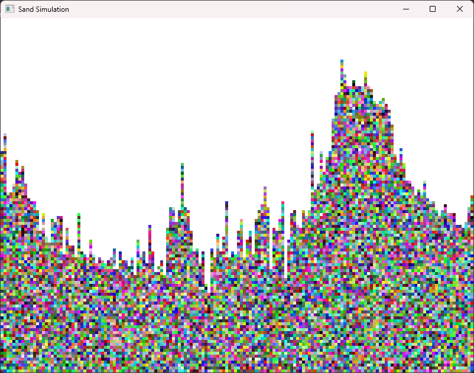
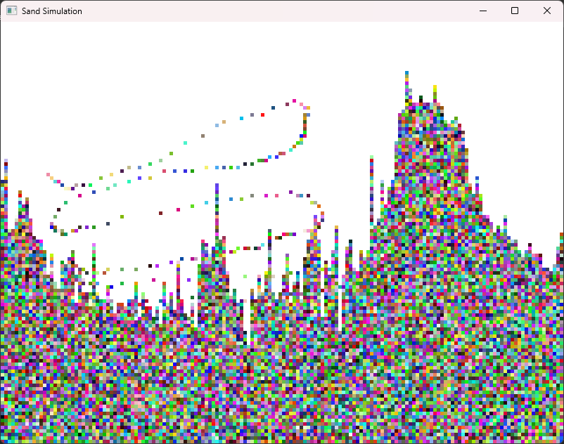

# Falling Sand Simulator
Simple grid based falling sand simulator.

## Screenshots

    
    

## General Info
This simulator starts by initializing random sand particles, then allowing the user to draw sand particles that are affected by gravity in a grid environment. Each sand particle's color is randomized when drawn. 

## External Libraries
* OpenGL
